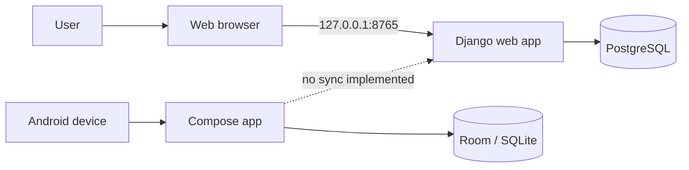
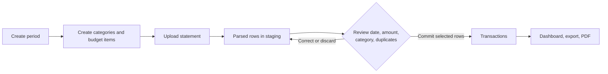

# Money Manager

Money Manager is a private, local-first budgeting application for tracking
periods, categories, budget items, bank statements, and credit-card statements.
The web application uses Django and PostgreSQL; the Android client is a separate
offline Room/Compose application.

## System overview



## Start here

Choose one web-app installation path:

```bash
# Native macOS setup (Homebrew, PostgreSQL, Python, LibreOffice)
bash installer/setup.sh

# Or a local Docker development stack
cp .env.example .env
docker compose up --build
```

Both paths serve the web UI at [http://127.0.0.1:8765](http://127.0.0.1:8765).
Docker binds the web and database ports to loopback only; it is intentionally a
local development deployment, not an internet-facing production configuration.

## Documentation

| Need | Guide |
| --- | --- |
| Pick an installation path and configure the app | [Installation](docs/INSTALLATION.md) |
| Create periods and budgets, import statements, and review transactions | [User guide](docs/USER_GUIDE.md) |
| Back up or restore financial data | [Backup and recovery](docs/BACKUP_AND_RECOVERY.md) |
| Develop, migrate, and test the project | [Development](docs/DEVELOPMENT.md) |
| Build and run the native client | [Android guide](android/README.md) |
| Operate the Docker stack | [Docker guide](docker/README.md) |
| Use the macOS installer | [Installer guide](installer/README.md) |

## Main workflow

1. Create a period with valid start and end dates; only one period can be active.
2. Create categories and add budget items for the period.
3. Upload a bank or credit-card statement. Parsed rows are staged for review;
   they are not transactions yet.
4. Assign categories, review duplicate warnings, and commit the rows you want.
   The app checks a row against the period that contains that row's date.
5. Use the dashboard, exports, and PDF summary to compare planned and actual
   amounts.

See the [user guide](docs/USER_GUIDE.md) for the detailed workflow and the
Android guide for notification capture.



## Project layout

```text
config/        Django configuration, URLs, middleware
finance/       models, forms, views, services, and migrations
templates/     Django templates
android/       native Kotlin/Compose/Room application
docker/        Docker entrypoint and Docker documentation
installer/     macOS setup and uninstall scripts
docs/          installation, user, operations, and development guides
sql/           historical/reference SQL; not the schema installation path
```

## Configuration and data safety

Copy `.env.example` to `.env` and set a unique `DJANGO_SECRET_KEY` and
`DB_PASSWORD`. Keep `.env`, database dumps, and Android keystores out of Git.
Set `DJANGO_DEBUG=False`, a strong secret key, HTTPS-related variables, and
`DJANGO_REQUIRE_LOGIN=True` before exposing any deployment beyond your machine.

Before upgrades, take a database backup. The recovery guide includes safe backup
and restore commands, and calls out destructive Docker commands explicitly.

## Validation

```bash
venv/bin/python manage.py check
venv/bin/python manage.py test
cd android && ./gradlew test --no-daemon
docker compose config --quiet
```

## License

Private / personal use.
