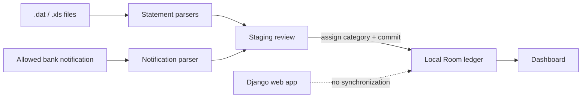
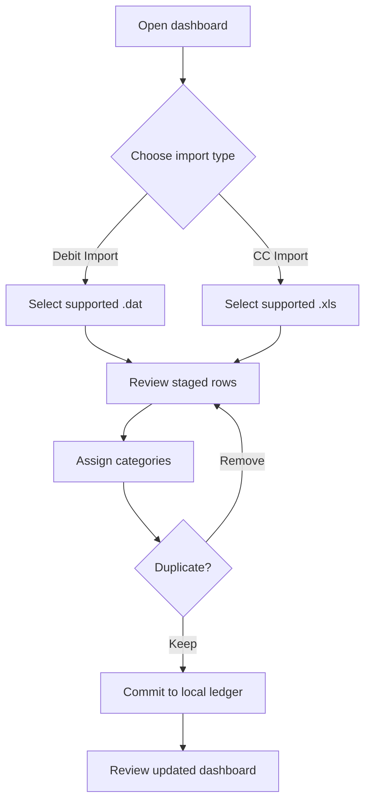
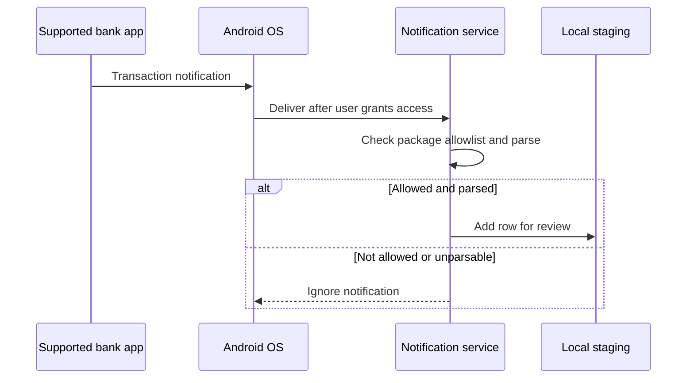

# Money Manager for Android

The Android app is an offline, native companion built with Kotlin, Jetpack
Compose, Room, and Hilt. Its data stays in the app's local SQLite database; it
does not currently synchronize with the Django web application.

## What the current app supports

- A period dashboard showing safe-to-spend, burn rate, and budget-item totals
  in Chilean pesos.
- Debit-statement staging from the supported Scotiabank Chile semicolon-delimited
  `.dat` export.
- Credit-card staging from the supported Scotiabank Chile legacy `.xls` export.
- Per-row category selection, duplicate choices, and committing reviewed rows to
  the local ledger.
- Optional capture of transaction-like notifications from the package allowlist
  in the app.

The native UI does **not yet** provide screens to create periods, categories, or
budget items, and it does not import data from the web app. A fresh install is
therefore useful for parser/notification testing, but cannot become a complete
stand-alone budget solely through the current screens. Use the web app for the
full budgeting workflow until those Android setup and synchronization features
are implemented.



## Requirements

- Android Studio (current stable release) or the Android SDK command-line tools
- JDK 17
- An Android device or emulator

Confirm the Java version before using Gradle:

```bash
java -version
```

## Build and test

From this directory:

```bash
./gradlew test --no-daemon
./gradlew assembleDebug
```

The debug APK is written to
`app/build/outputs/apk/debug/app-debug.apk`. Open `android/` in Android Studio
and use Run to install it on a connected device or emulator.

For a manual install:

```bash
adb install app/build/outputs/apk/debug/app-debug.apk
```

Use `adb devices` first to confirm that the target device is connected.

## Using the app

1. Open the dashboard and, when local periods exist, use the **Period** selector
   to choose the period to inspect. The dashboard shows income and expense
   budget items, actual totals, projected totals, safe-to-spend, and burn rate.
2. Select **Debit Import** for a supported `.dat` statement, or **CC Import**
   for a supported `.xls` credit-card statement. Android's file picker is used;
   the app only reads the file you select.
3. In the staging screen, inspect the parsed date, description, amount, and
   transaction type. Assign a category to every row you intend to commit.
4. For a duplicate warning, choose **Keep** to include the row or **Remove from
   staging** to discard it. Rows with no selected category are skipped.
5. Select **Commit to Ledger**. Transactions are written only to the device's
   Room database and appear in dashboard totals for the period containing their
   date.

Treat parsing and duplicate detection as review aids. Compare the staged rows
against the original bank statement before committing them.



## Data and upgrades

Room stores periods, categories, budget items, transactions, staging rows, and
import-batch metadata in `money_manager.db`. Schema changes require a versioned
Room migration that preserves existing user data. Do not add destructive fallback
migrations.

## Bank-notification capture

The optional `BankNotificationService` can parse transaction-like notifications
from a strict allowlist of supported banking package names. Android requires the
user to grant notification-listener access in system settings; the service should
only be enabled when the device owner understands and accepts that access.

Captured values are staged for review. Parsing is heuristic, so verify the date,
amount, and category before treating a row as a final record.

To enable the service, open Android Settings and grant
**Apps → Special app access → Notification access → Money Manager**. The system
shows this as sensitive access because notification text can contain financial
information. Disable it in the same settings page when it is no longer needed.

The allowlist currently contains Scotiabank Chile, BCI, Santander, BancoEstado,
Itaú, and Banco Falabella package identifiers. A notification that does not
match the parser's expected format is ignored.



## Release signing

Keep release keystores and passwords outside the repository. Build a signed
release through Android Studio's **Generate Signed App Bundle or APK** flow, or
configure the repository's Gradle signing setup in your private environment.
Losing a signing key prevents updating an already-installed release.

## Related guides

- [Web installation](../docs/INSTALLATION.md)
- [Development workflow](../docs/DEVELOPMENT.md)
- [Web user guide](../docs/USER_GUIDE.md)
