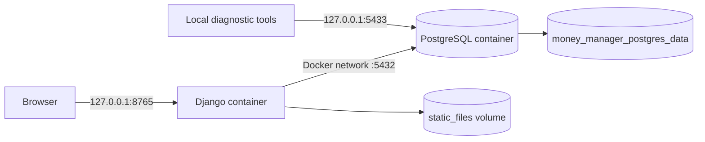
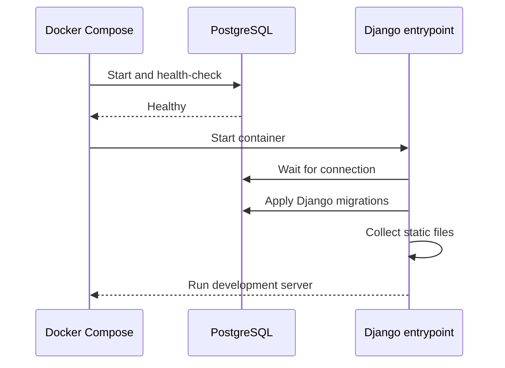

# Docker deployment

Docker Compose runs the Django application and PostgreSQL locally. The published
ports are bound to `127.0.0.1`, so this configuration is intended for a single
machine and development use.



## Requirements

Install and start Docker Desktop, then verify both commands succeed:

```bash
docker --version
docker compose version
```

## Start the stack

From the repository root:

```bash
cp .env.example .env
# Edit .env: at minimum set a unique DJANGO_SECRET_KEY and DB_PASSWORD.
docker compose up --build
```

Open [http://127.0.0.1:8765](http://127.0.0.1:8765). The entrypoint waits for
PostgreSQL, applies `manage.py migrate`, and collects static files. Django
migrations—not the legacy `sql/` scripts—own the database schema.

Run in the background with `docker compose up -d --build`; inspect the app with
`docker compose logs -f web`.



## Daily operations

| Task | Command |
| --- | --- |
| Stop containers and preserve data | `docker compose down` |
| Rebuild after dependency or Dockerfile changes | `docker compose up --build` |
| Open a Django shell | `docker compose exec web python manage.py shell` |
| Apply migrations explicitly | `docker compose exec web python manage.py migrate` |
| Check configuration without starting services | `docker compose config --quiet` |

The web app uses host port `8765` by default; override it with `APP_PORT` in
`.env`. PostgreSQL is available only on `127.0.0.1:5433` for local diagnostic
tools.

## Persistence and safety

The named `money_manager_postgres_data` volume survives `docker compose down`.
Back up before upgrades; see [Backup and recovery](../docs/BACKUP_AND_RECOVERY.md).

`docker compose down -v` destroys that volume and all database data. Only run it
when you deliberately want an empty database and have a verified backup.

## Environment variables

| Variable | Purpose |
| --- | --- |
| `DJANGO_SECRET_KEY` | Unique secret for Django sessions and cryptographic signing |
| `DJANGO_DEBUG` | Keep `True` for local development; set `False` only with production-ready settings |
| `DJANGO_ALLOWED_HOSTS` | Space-separated hosts accepted by Django |
| `DJANGO_REQUIRE_LOGIN` | Set `True` to require authenticated access even in local debug mode |
| `DB_PASSWORD` | Password for the Compose PostgreSQL user |
| `APP_PORT` | Local web port; defaults to `8765` |
