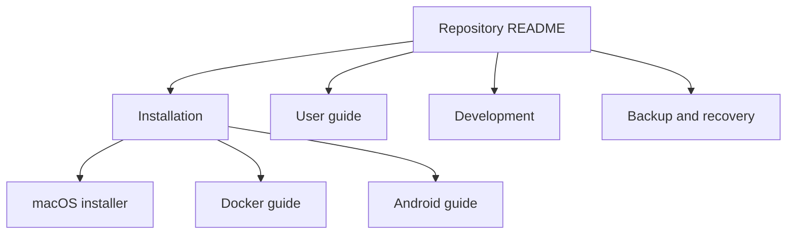

# Documentation index

| Guide | Use it for |
| --- | --- |
| [Installation](INSTALLATION.md) | Native, Docker, and Android setup |
| [User guide](USER_GUIDE.md) | Periods, budgets, imports, review, and reports |
| [Backup and recovery](BACKUP_AND_RECOVERY.md) | Preserving and restoring PostgreSQL data |
| [Development](DEVELOPMENT.md) | Local workflow, tests, migrations, and project conventions |

The repository [README](../README.md) is the starting point and links to the
platform-specific Docker, Android, and macOS-installer guides.

