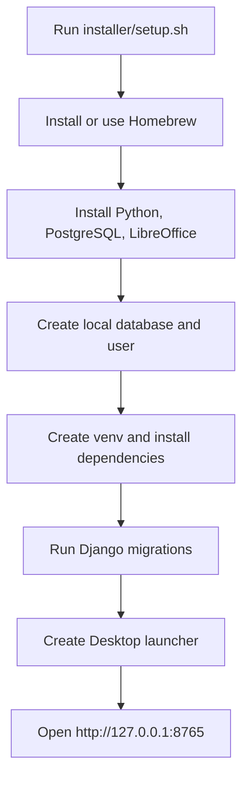
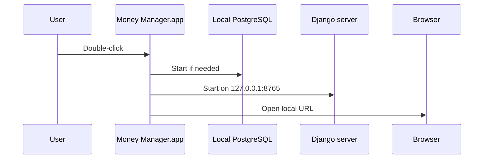

# Installers

## Linux and Termux

The Linux installer uses SQLite by default, so PostgreSQL is not required on a
Linux workstation or in Termux. It installs the project into the local `venv`
directory and keeps the database in `db.sqlite3`.

```bash
bash installer/setup-linux.sh
bash installer/run-linux.sh
```

Open `http://127.0.0.1:8765` if Termux cannot launch a browser automatically.
For Termux, install the repository under `$HOME` rather than shared storage so
Python can execute files and create the virtual environment reliably.

The Linux installer does not install PostgreSQL. Existing PostgreSQL setups can
continue using the macOS-oriented installer below or set `DB_ENGINE=postgresql`
and the normal `DB_*` variables in `.env`.

## macOS

`setup.sh` prepares a native macOS development installation and creates a
desktop launcher. It is for local use, not a production deployment.



## What it installs

- Homebrew, if necessary
- Python 3
- PostgreSQL 16
- LibreOffice, used as a statement-parsing fallback
- A project-local Python virtual environment and Django dependencies

The installer creates the `money_manager` database and user, writes `.env` only
when one does not already exist, then runs Django migrations. Django migrations
are the schema authority; do not apply the historical `sql/` files to a new
installation.

## Install

Run from the repository root:

```bash
bash installer/setup.sh
```

The script may install packages and create a local database user. Review it and
allow the prompts only on a machine you control. It creates **Money Manager.app**
on the Desktop; opening it starts PostgreSQL, starts Django on
`http://127.0.0.1:8765`, and opens the browser.



## Manual launch

```bash
bash start.sh
```

Or activate the virtual environment and run Django directly:

```bash
source venv/bin/activate
python manage.py runserver 127.0.0.1:8765
```

## Uninstall

```bash
bash installer/uninstall.sh
```

This removes the virtual environment, `.env`, and the Desktop launcher. It does
not drop the PostgreSQL database or remove Homebrew packages. Back up the
database first if you might need the data later; see
[Backup and recovery](../docs/BACKUP_AND_RECOVERY.md).
